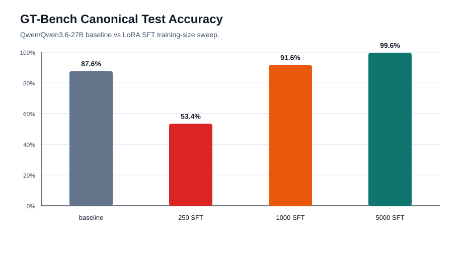
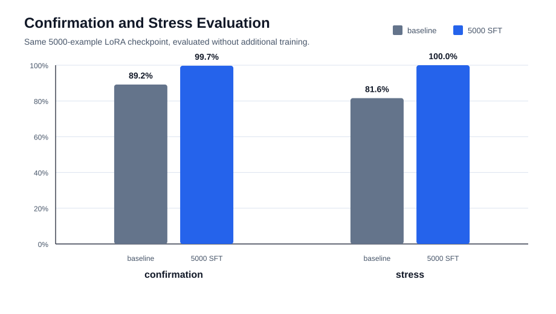
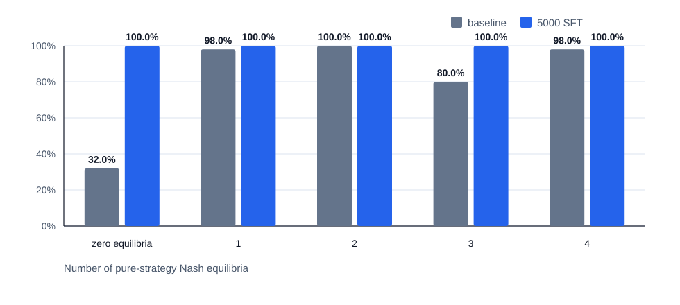
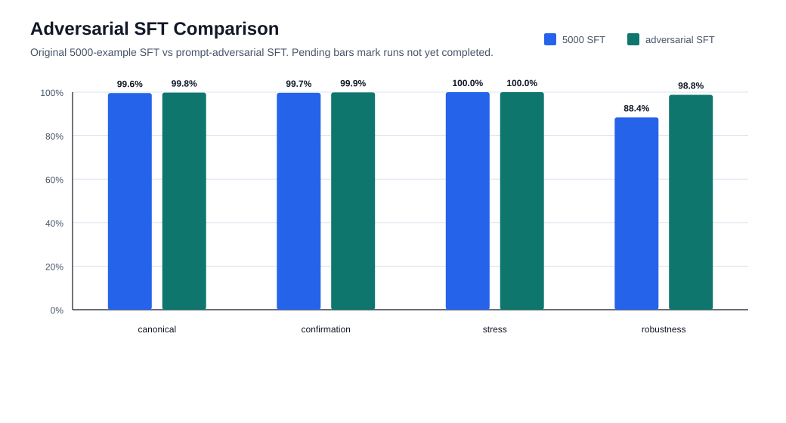
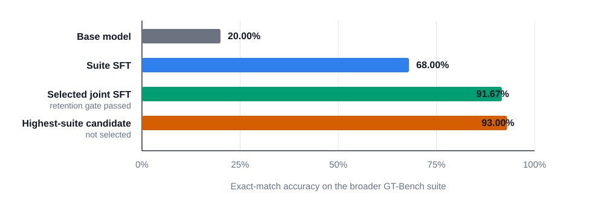
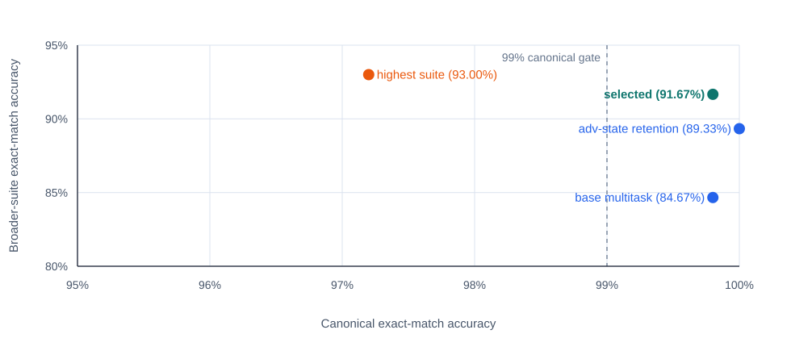
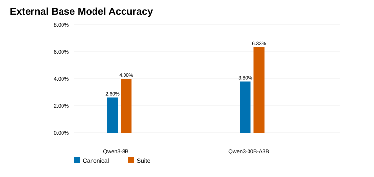
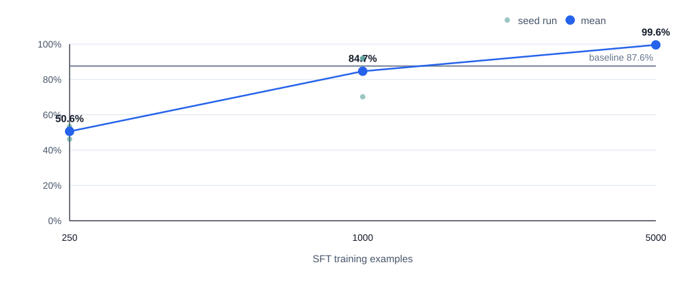

# GT-Bench: Verifiable Game-Theory Reasoning Tasks

## Project overview

GT-Bench is a compact Tinker fine-tuning benchmark for strategic reasoning. The reported experiment uses a narrow, fully verifiable 2x2 normal-form task and asks a model to find all pure-strategy Nash equilibria with a brief explanation.

The repository now has two layers:

- `generate_dataset.py` and `score_predictions.py`: the canonical 2x2 pure-equilibrium experiment used for the published Qwen3.6-27B result.
- `generate_benchmark_suite.py` and `score_suite.py`: the broader suite covering mixed 2x2 equilibria, dominance, larger normal-form games, extensive-form games, natural-language game descriptions, and repeated interaction.

For the consolidated research narrative, see `TECHNICAL_REPORT.md`. The adversarial robustness follow-up is tracked in `ROBUSTNESS.md` and `reports/adversarial_results.md`. The repeated-seed learning curve is tracked in `reports/seed_sweep_results.md`. The broader-suite and retention-aware multitask results are tracked in `reports/suite_results.md` and `reports/multitask_results.md`. An arXiv-ready paper draft is available at `paper/gt_bench_paper.tex`.

## My context

This project is by Mert Gulsun, a UC Berkeley master's student and Thinking Machines Lab Tinker research grant recipient.

The goal is to demonstrate measurable improvement from targeted fine-tuning on formal game-theory reasoning using a 12-month, $5,000 Tinker research credit allocation.

## Paper draft

The paper source is intentionally arXiv-friendly: one LaTeX file, PNG figures under `paper/figures/`, and an inline bibliography. Build it with the bundled Tectonic engine or any LaTeX distribution that supports the packages in the source.

```bash
mkdir -p paper/build
/path/to/tectonic --outdir paper/build paper/gt_bench_paper.tex
```

The local build output and arXiv source zip live under `paper/build/`, which is ignored by git.

## Canonical task

Each example is a 2x2 two-player normal-form payoff matrix.

- Player 1 chooses `U` or `D`.
- Player 2 chooses `L` or `R`.
- Each cell contains `(Player 1 payoff, Player 2 payoff)`.

The model must find all pure-strategy Nash equilibria. A profile is a pure Nash equilibrium when both players are best responding at that cell. Ties are handled exactly, so a game may have zero, one, two, three, or four pure equilibria.

The headline Qwen3.6-27B result is the canonical task. The repo also includes a selected retention-aware joint checkpoint for the broader suite, reported separately from the canonical-only claim.

## Broader suite

The broader suite is deterministic and exactly scored. It has local smoke baselines, an oracle check, a suite-only Tinker checkpoint, a retention-aware multitask sweep, a three-seed repeat of the selected joint recipe, and two base-model availability comparisons. It adds six task families:

- `mixed_2x2`: fully mixed equilibria for 2x2 games with no pure equilibrium.
- `dominance`: iterated elimination of strictly dominated pure strategies.
- `large_normal_form`: pure equilibria in 2x3 and 3x3 normal-form games.
- `extensive_form`: backward induction in perfect-information sequential games.
- `natural_language`: story descriptions that must be mapped to payoff/action structure.
- `repeated_interaction`: finite repeated prisoner's-dilemma simulations and best-response selection among fixed policies.

## Why this is useful

The task is narrow, synthetic, and fully verifiable. That makes it useful for testing whether targeted fine-tuning improves a specific reasoning skill instead of relying on subjective grading.

Because examples are easy to generate at scale and evaluate exactly, GT-Bench can support a clean before-and-after comparison between a base model and a fine-tuned model.

## How to generate data

Install the test dependency if needed:

```bash
python3 -m venv .venv
.venv/bin/python -m pip install -r requirements.txt
```

Generate train, validation, and test splits:

```bash
.venv/bin/python generate_dataset.py --train 5000 --val 500 --test 500 --seed 42 --out data/
```

This writes:

- `data/train.jsonl`
- `data/val.jsonl`
- `data/test.jsonl`
- `data/train_chat.jsonl`
- `data/val_chat.jsonl`
- `data/test_chat.jsonl`

Small sample files are included in `examples/`.

Generate one broader-suite file:

```bash
.venv/bin/python generate_benchmark_suite.py \
  --per-family 50 \
  --seed 20260511 \
  --out data/suite/gt_bench_suite.jsonl \
  --chat-out data/suite/gt_bench_suite_chat.jsonl
```

Small suite samples are included in `examples/sample_suite.jsonl` and `examples/sample_suite_chat.jsonl`.

Generate train/validation/test broader-suite splits:

```bash
.venv/bin/python generate_benchmark_suite.py \
  --train-per-family 200 \
  --val-per-family 10 \
  --test-per-family 50 \
  --seed 20260511 \
  --out-dir data/suite
```

This writes 1200 train, 60 validation, and 300 test examples under `data/suite/`.

Generate deterministic retention-aware multitask training files and the public manifest:

```bash
.venv/bin/python make_multitask_training.py
```

Generate a balanced stress set with equal numbers of 0-, 1-, 2-, 3-, and 4-equilibrium games:

```bash
.venv/bin/python generate_stress_set.py \
  --per-count 50 \
  --seed 314159 \
  --out data/stress/tie_stress_seed314159.jsonl \
  --chat-out data/stress/tie_stress_seed314159_chat.jsonl
```

## How to fine-tune

Use `data/train_chat.jsonl` as the fine-tuning file on Tinker. Each row contains a user message with the matrix prompt and an assistant message with:

- a final answer listing the pure-strategy Nash equilibria
- concise reasoning based on exact best responses

Use `data/val_chat.jsonl` as a held-out validation file if the fine-tuning workflow supports it.

For the Qwen3.6-27B Tinker experiment, install the optional Tinker dependencies:

```bash
.venv/bin/python -m pip install -r requirements-tinker.txt
```

Export your Tinker key locally. Do not put it in tracked files, shell scripts, notebooks, reports, or README examples:

```bash
export TINKER_API_KEY="..."
```

Validate access to the exact model configured in `bench_config.json`:

```bash
.venv/bin/python run_tinker_preflight.py --config bench_config.json
```

Create the training-size sweep files:

```bash
.venv/bin/python make_sweep_splits.py --config bench_config.json
```

This writes:

- `data/sweeps/train_0250_chat.jsonl`
- `data/sweeps/train_1000_chat.jsonl`
- `data/sweeps/train_5000_chat.jsonl`

Run the baseline on `Qwen/Qwen3.6-27B`:

```bash
.venv/bin/python run_tinker_predict.py \
  --config bench_config.json \
  --gold data/test.jsonl \
  --out predictions/baseline_qwen36_27b.jsonl
```

`bench_config.json` uses deterministic decoding with `max_tokens` set high enough to let the base model finish its reasoning and final answer. You can override this with `--max-tokens` for smoke tests.

Run the three LoRA SFT jobs:

```bash
.venv/bin/python run_tinker_sft.py \
  --config bench_config.json \
  --train-chat data/sweeps/train_0250_chat.jsonl \
  --run-name qwen36_27b_sft_0250 \
  --out-manifest runs/qwen36_27b_sft_0250.json

.venv/bin/python run_tinker_sft.py \
  --config bench_config.json \
  --train-chat data/sweeps/train_1000_chat.jsonl \
  --run-name qwen36_27b_sft_1000 \
  --out-manifest runs/qwen36_27b_sft_1000.json

.venv/bin/python run_tinker_sft.py \
  --config bench_config.json \
  --train-chat data/sweeps/train_5000_chat.jsonl \
  --run-name qwen36_27b_sft_5000 \
  --out-manifest runs/qwen36_27b_sft_5000.json
```

Each manifest records the sampler checkpoint path. Use that path to evaluate the fine-tuned run:

```bash
.venv/bin/python run_tinker_predict.py \
  --config bench_config.json \
  --gold data/test.jsonl \
  --model-path "tinker://..." \
  --out predictions/qwen36_27b_sft_0250.jsonl
```

## How to evaluate

Run the base model on `data/test.jsonl` and save predictions as JSONL:

```json
{"id": "example_000001", "prediction": "The pure-strategy Nash equilibria are (U, L) and (D, R)."}
```

Score the baseline predictions:

```bash
.venv/bin/python score_predictions.py --gold data/test.jsonl --pred predictions_baseline.jsonl --out reports/baseline_report.json
```

Run the fine-tuned model on the same `data/test.jsonl`, save predictions to `predictions_finetuned.jsonl`, and score them:

```bash
.venv/bin/python score_predictions.py --gold data/test.jsonl --pred predictions_finetuned.jsonl --out reports/finetuned_report.json
```

Compare exact-match accuracy between `reports/baseline_report.json` and `reports/finetuned_report.json`.

Score broader-suite predictions with:

```bash
.venv/bin/python score_suite.py \
  --gold data/suite/test.jsonl \
  --pred predictions/suite_predictions.jsonl \
  --out reports/suite_report.json
```

The suite scorer reports exact-match accuracy overall and by task family.

Run deterministic local suite baselines and regenerate the public suite summary:

```bash
.venv/bin/python run_suite_baselines.py \
  --gold data/suite/test.jsonl \
  --train data/suite/train.jsonl \
  --pred-dir predictions/suite_baselines \
  --out-json reports/suite_results.json \
  --out-md reports/suite_results.md \
  --figure reports/figures/suite_smoke_accuracy.svg
```

The public suite summary includes deterministic baselines plus completed Tinker model rows when the matching raw reports are present. It preserves the published model rows for this exact public suite split so `make check` does not require a Tinker key.

Regenerate the multitask summary after scoring joint checkpoints:

```bash
.venv/bin/python summarize_multitask_results.py
```

For the Qwen3.6-27B sweep, score each prediction file:

```bash
.venv/bin/python score_predictions.py \
  --gold data/test.jsonl \
  --pred predictions/baseline_qwen36_27b.jsonl \
  --out reports/baseline_qwen36_27b_report.json

.venv/bin/python score_predictions.py \
  --gold data/test.jsonl \
  --pred predictions/qwen36_27b_sft_0250.jsonl \
  --out reports/qwen36_27b_sft_0250_report.json

.venv/bin/python score_predictions.py \
  --gold data/test.jsonl \
  --pred predictions/qwen36_27b_sft_1000.jsonl \
  --out reports/qwen36_27b_sft_1000_report.json

.venv/bin/python score_predictions.py \
  --gold data/test.jsonl \
  --pred predictions/qwen36_27b_sft_5000.jsonl \
  --out reports/qwen36_27b_sft_5000_report.json
```

Then summarize the reports:

```bash
.venv/bin/python summarize_results.py \
  --config bench_config.json \
  --baseline reports/baseline_qwen36_27b_report.json \
  --run qwen36_27b_sft_0250=reports/qwen36_27b_sft_0250_report.json \
  --run qwen36_27b_sft_1000=reports/qwen36_27b_sft_1000_report.json \
  --run qwen36_27b_sft_5000=reports/qwen36_27b_sft_5000_report.json \
  --confirmation-gold data/confirm/confirm_seed20260505.jsonl \
  --confirmation-baseline reports/confirm_baseline_qwen36_27b_seed20260505_report.json \
  --confirmation-run qwen36_27b_sft_5000=reports/confirm_qwen36_27b_sft_5000_seed20260505_report.json \
  --stress-gold data/stress/tie_stress_seed314159.jsonl \
  --stress-baseline reports/stress_baseline_qwen36_27b_seed314159_report.json \
  --stress-run qwen36_27b_sft_5000=reports/stress_qwen36_27b_sft_5000_seed314159_report.json \
  --out-json reports/gt_bench_results.json \
  --out-md reports/gt_bench_results.md
```

Generate static SVG figures from the public summary:

```bash
.venv/bin/python plot_results.py \
  --summary reports/gt_bench_results.json \
  --robustness reports/robustness_results.json \
  --adversarial reports/adversarial_results.json \
  --seed-sweep reports/seed_sweep_results.json \
  --out-dir reports/figures
```

## Expected result

The demonstrated headline result is the canonical 2x2 pure-equilibrium improvement after fine-tuning. The broader suite is evaluated separately. Base `Qwen/Qwen3.6-27B` scored 20.00%, the suite-only SFT checkpoint reached 68.00% but retained only 53.60% canonical accuracy, and the selected retention-aware joint checkpoint reached 91.67% suite accuracy while retaining 99.80% canonical accuracy and 99.60% prompt-robustness accuracy. Across seeds 42, 1009, and 2027, the selected recipe averaged 92.56% suite accuracy and 99.93% canonical accuracy.

## Current Qwen3.6-27B result

On the canonical 500-example held-out test split, `Qwen/Qwen3.6-27B` improved from 87.60% exact-match accuracy at baseline to 99.60% after LoRA SFT on 5000 synthetic examples.

| Run | Accuracy | Correct | Incorrect | Delta vs baseline |
| --- | ---: | ---: | ---: | ---: |
| baseline | 87.60% | 438 | 62 | 0.00 pp |
| 250-example SFT | 53.40% | 267 | 233 | -34.20 pp |
| 1000-example SFT | 91.60% | 458 | 42 | +4.00 pp |
| 5000-example SFT | 99.60% | 498 | 2 | +12.00 pp |

On an independent 1000-example confirmation set generated with seed `20260505`, the same 5000-example fine-tuned checkpoint improved from 89.20% baseline accuracy to 99.70%.

On a balanced 250-example stress set with 50 examples in each equilibrium-count bucket from 0 through 4, the same checkpoint improved from 81.60% baseline accuracy to 100.00%.

The full report is in `reports/gt_bench_results.md`. For the research narrative and reproducibility details, see `RESULTS.md`, `REPRODUCIBILITY.md`, and `FAILURE_ANALYSIS.md`.

On a 250-example prompt-robustness set, the same checkpoint improved from 64.00% baseline accuracy to 88.40%. See `ROBUSTNESS.md` for the prompt-variant breakdown.

Across a three-seed repeated training-data sweep on the fixed canonical test set, the 5000-example SFT condition was stable: 99.60% mean accuracy with 0.40 percentage-point seed SD. The 1000-example condition was volatile, with one seed dropping to 70.20%, while the 250-example condition consistently underperformed baseline. See `reports/seed_sweep_results.md`.

The broader-suite and multitask results are tracked in `reports/suite_results.md` and `reports/multitask_results.md`. The latter includes the explicit experiment coverage matrix: four candidate recipes across five evaluations, three selected-recipe seeds across canonical and suite evaluations, two external base models across canonical and suite evaluations, and the documented reason conditional follow-up SFT was not required. The selected checkpoint is `joint_adv_targeted_retention`: it is the best suite performer among candidates that meet the canonical and prompt-robustness retention gates. `joint_base_full_targeted` reached 93.00% suite accuracy but was not selected because it fell to 97.20% canonical accuracy and 94.40% robustness.

## Adversarial robustness follow-up

The remaining weakness after the first robustness run was prompt format sensitivity: `compact_pairs` and `json_payoffs` were weaker than the original table prompt. The controlled follow-up adds a conservative 500-example adversarial prompt supplement to the 5000-example training set while keeping the mathematical task unchanged.

Generate the supplemental training file and combined 5500-example chat file:

```bash
.venv/bin/python generate_adversarial_training.py
```

Run the adversarial SFT job:

```bash
.venv/bin/python run_tinker_sft.py \
  --config bench_config.json \
  --train-chat data/adversarial/train_5500_prompt_adv500_chat.jsonl \
  --run-name qwen36_27b_sft_5000_plus_prompt_adv500 \
  --out-manifest runs/qwen36_27b_sft_5000_plus_prompt_adv500.json
```

The adversarial checkpoint reached 99.80% canonical accuracy, 99.90% confirmation accuracy, 100.00% stress accuracy, and 98.80% prompt-robustness accuracy. `compact_pairs` improved to 100.00%, and `json_payoffs` improved to 94.00%.

The public follow-up summary is `reports/adversarial_results.md`, with machine-readable results in `reports/adversarial_results.json`.

## Repeated-seed learning curve

Generate the additional training-data seed splits:

```bash
.venv/bin/python make_repeated_seed_splits.py --seed 1009 --seed 2027
```

After running the seed-specific SFT jobs and scoring each checkpoint on `data/test.jsonl`, summarize the repeated-seed statistics:

```bash
.venv/bin/python summarize_seed_sweep.py
```

The public repeated-seed summary is `reports/seed_sweep_results.md`, with machine-readable statistics in `reports/seed_sweep_results.json`.

## Result figures


















## Limitations

GT-Bench is deliberately bounded. The canonical task uses synthetic 2x2 games and pure equilibria only. The broader suite adds mixed equilibria, dominance, larger normal-form games, extensive form, natural-language descriptions, and repeated interaction, but it still uses exact synthetic tasks and fixed answer formats.

It is best understood as a controlled fine-tuning benchmark with a broader exact diagnostic suite, not as evidence of general game-theory competence.

## Testing

Run:

```bash
.venv/bin/python -m pytest -q
.venv/bin/python check_no_secrets.py
.venv/bin/python summarize_adversarial.py
.venv/bin/python plot_results.py
```

The tests cover a Prisoner's Dilemma style one-equilibrium game, a coordination game with two equilibria, a matching pennies style game with no pure equilibrium, a tie case with multiple best responses, and common prediction parser formats.

`check_no_secrets.py` scans tracked git files for Tinker API key markers before committing.
