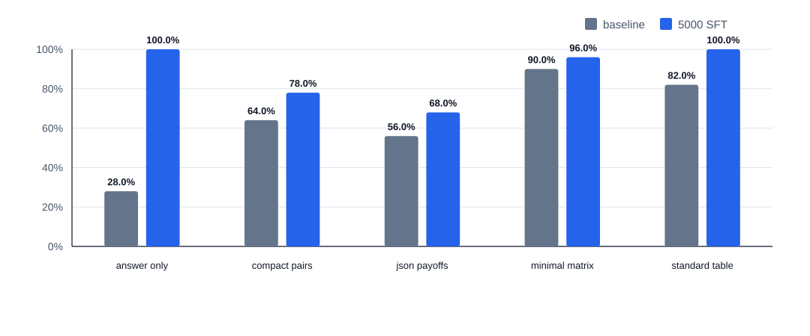

# GT-Bench Robustness Evaluation

## Summary

This evaluation tests whether the 5000-example SFT checkpoint learned the 2x2 pure-strategy Nash equilibrium rule robustly across prompt surfaces, rather than only matching the original table template.

The robustness set contains 250 examples:

- 5 prompt variants
- 5 equilibrium-count buckets
- 10 examples per variant-bucket pair

The mathematical task is unchanged. Only the prompt surface changes.

## Prompt Variants

- `standard_table`: the original GT-Bench table prompt
- `compact_pairs`: semicolon-separated payoff pairs
- `json_payoffs`: JSON-like payoff object
- `minimal_matrix`: terse matrix with minimal prose
- `answer_only`: original task plus an instruction to return only the final answer

## Result

| Run | Accuracy | 95% exact binomial CI | Correct | Incorrect | Delta vs baseline |
| --- | ---: | ---: | ---: | ---: | ---: |
| baseline | 64.00% | 57.71%-69.95% | 160 | 90 | 0.00 pp |
| 5000-example SFT | 88.40% | 83.77%-92.09% | 221 | 29 | +24.40 pp |

## Accuracy By Prompt Variant

| Prompt variant | Baseline | 5000-example SFT | Delta |
| --- | ---: | ---: | ---: |
| `answer_only` | 28.00% | 100.00% | +72.00 pp |
| `compact_pairs` | 64.00% | 78.00% | +14.00 pp |
| `json_payoffs` | 56.00% | 68.00% | +12.00 pp |
| `minimal_matrix` | 90.00% | 96.00% | +6.00 pp |
| `standard_table` | 82.00% | 100.00% | +18.00 pp |

## Interpretation

The fine-tuned checkpoint substantially improves robustness, especially on the original table prompt and the answer-only variant. That supports the claim that targeted fine-tuning improved the underlying task behavior, not just the canonical held-out split.

The checkpoint is not fully prompt-invariant. `compact_pairs` and `json_payoffs` remain weaker, which motivates an adversarial SFT slice that includes compact and structured payoff presentations.

## Adversarial Follow-Up Result

The targeted adversarial SFT run keeps the same 2x2 pure-equilibrium task and adds a conservative 500-example prompt-variant supplement to the 5000-example training set, with extra weight on `compact_pairs` and `json_payoffs`.

It improved overall prompt-robustness accuracy from 88.40% to 98.80% versus the original 5000-example SFT checkpoint. `compact_pairs` improved from 78.00% to 100.00%, and `json_payoffs` improved from 68.00% to 94.00%, while canonical accuracy increased from 99.60% to 99.80%.

The complete follow-up summary is `reports/adversarial_results.md`.
